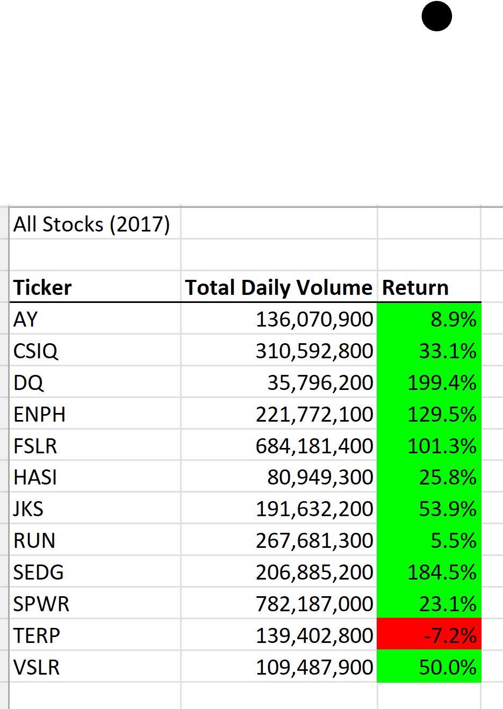

# VBAChallenge
Homework Week 2
## Overview of Project
### Purpose:
The purpose of this project was to easily analyze an entire dataset and learn how to refactor previous VBA code to deal with a new senerio. In this senerio we are using VBA to look at a dozon stocks and determine the total volume and return percentage for each Stock. 

## Results
I started this code with the code 'challenge_starter_code.vbs' given by the module and the 'green_stocks.xlsm' I used as going through the module. 
### Step 1:
#### Step 1a: 

Doing these two steps are used to difine the four variables we will be using in our for loops.

In this step I created the 'tickerIndex' variable (as a single) and initalized it at 0.
  ```
  Dim tickerIndex As Single
  tickerIndex = 0'
```

#### Step 1b:
In this step I created the three arrays: tickerVolumes (as long), tickerStartingPrices (as single), and tickerEndingPrices (as single). I also defined the arrays for being 12 items long.
```   
    Dim tickerVolumes(12) As Long
    Dim tickerStartingPrices(12) As Single
    Dim tickerEndingPrices(12) As Single
```


### Step 2
In this step we initialize all arrays to 0 and created 2 different for loops.

#### Step 2a:
In this step I created a for loop to initalize all arrays created above at 0 and to go through the array 12 times. 
```
 For i = 0 To 11
        tickerVolumes(i) = 0
        tickerStartingPrices(i) = 0
        tickerEndingPrices(i) = 0
 Next i
```

#### Step 2b:
In this stup I started a for loop for the rest of the spreadsheet. I am using this loop to define the rows. I started this loop at row 2 as this is the first row of data in the datasets. The last row is "rowcount" which is a varble counted above where the final number is the last row which has variables in the dataset. 
```    
    For j = 2 To RowCount
```

### Step 3
In this step we are telling the for loop how we wish to calculate the data.

#### Step 3a:
In this step we are increasing the ticker volume inside the previous "j" loop. this used the tickerIndex variable from step 1a to do so. 

```
 tickerVolumes(tickerIndex) = tickerVolumes(tickerIndex) + Cells(j, 8).Value
```
#### Step 3b: 
In this step we are using an if-then statement to assign the tickerStartingPrices variable. We are still using tickerIndex as the array number. We are checking that the current row that we are in (j) is the first row that had the tickerIndex number that is currently the array number.
```
 If Cells(j, 1).Value = tickers(tickerIndex) And Cells(j - 1, 1).Value <> tickers(tickerIndex) Then
        tickerStartingPrices(tickerIndex) = Cells(j, 6).Value
    End If
```

#### Step 3c:
In this step we are using a different if-then statement to assign the tickerEndingPrices variable. We are still using tickerIndex as the array number. We are checking that the current row that we are in (j) is the last row that had the tickerIndex number that is currently the array number.
```
 If Cells(j - 1, 2).Value <> tickers(tickerIndex) Then
        tickerEndingPrices(tickerIndex) = Cells(j, 6).Value
   
       End If
```
#### Step 3d:
In this last part of thsis for loop we are increasing the tickerIndex by checking that the tickerIndex of the cell we are in is the not the same as the tickerIndex. If this is true then the tickerIndex increases by 1. We are also going to end the for loop.
```
 If Cells(j, 1).Value = tickers(tickerIndex) And Cells(j + 1, 1).Value <> tickers(tickerIndex) Then
            tickerIndex = tickerIndex + 1
        End If   
  Next j
```

### Step 4:
In this last step we are going to creat another for loop to loop through all og the arrays and display the outputs in the Excel sheet. 

The tickers will be displayed in coloumn 1 with the first value being displayed in row 4 hence the rows being calculated as (4+k). The tickerVolume will be displayed in coloumn 2, and the return (tickerEndingPrices(k)/tickerStartingPrices(k)-1)in cloumn 3.
```
  Worksheets("All Stocks Analysis").Activate
    For k = 0 To 11
        
        Cells(4 + k, 1).Value = tickers(k)
        Cells(4 + k, 2).Value = tickerVolumes(k)
        Cells(4 + k, 3).Value = tickerEndingPrices(k) / tickerStartingPrices(k) - 1        
    Next k
```

##After formatting the file the final outputs for 2017 and 2018 are below:



## Summary
### There is a detailed statement on the advantages and disadvantages of refactoring code in general.
### There is a detailed statement on the advantages and disadvantages of the original and refactored VBA script.
